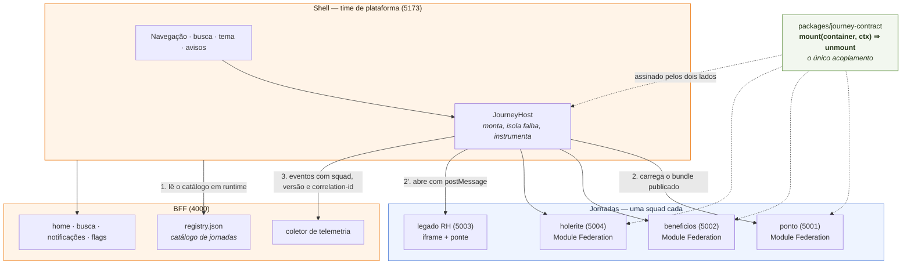

<div align="center">

# Portal Pessoas

**Portal corporativo com múltiplas jornadas, múltiplas squads, convivência com legado
e evolução incremental.**
Case técnico — proposta de arquitetura (Parte 1) + implementação reduzida e executável (Parte 2).


</div>

---

## Por onde começar

| Documento | O que responde |
| --- | --- |
| **[Parte 1 — Proposta de arquitetura](docs/01-proposta-tecnica.md)** | Arquitetura, web+mobile, squads, microfrontends, DS, migração, observabilidade |
| **[Decisões registradas (11 ADRs)](docs/adr/)** | Por que cada escolha foi feita, o que ela custa e o que foi descartado |
| **Parte 2 — esta aplicação** | [Como rodar](#como-rodar) e o [roteiro de demonstração](#roteiro-de-demonstração) abaixo |
| **[Casca móvel](mobile/README.md)** | Onde fica a linha entre nativo e web, e o protocolo da ponte |

---

## Como rodar

> **Requisitos:** Node 20+ e npm 10+. Nenhum serviço externo, nenhuma variável de ambiente.

```bash
npm install
npm start
```

Abra **<http://localhost:5173>**.

Um `npm start` sobe seis processos — cada um representando um time diferente:

| Serviço | Porta | Dono | O que é |
| --- | :---: | --- | --- |
| **Shell** | `5173` | plataforma | Aplicação principal (host): navegação, busca, tema, avisos |
| **BFF** | `4000` | plataforma | Registro de jornadas, home, busca, notificações, flags, telemetria |
| Jornada `ponto` | `5001` | squad Jornada de Trabalho | Microfrontend (Module Federation) |
| Jornada `beneficios` | `5002` | squad Benefícios | Microfrontend (Module Federation) |
| Jornada `holerite` | `5004` | squad Remuneração | Microfrontend (Module Federation) |
| Sistema legado | `5003` | squad Legado RH | Plataforma de RH legada simulada (iframe) |

Cada jornada também roda sozinha, sem shell — é assim que a squad desenvolve no dia a dia:

```bash
npm run dev -w @portal/journey-ponto     # http://localhost:5001
```

### Outros comandos

| Comando | O que faz |
| --- | --- |
| `npm test` | 113 testes unitários (Vitest) em ~1,3 s |
| `npm run test:watch` | idem, em watch |
| `npm run typecheck` | tipos dos 4 apps + dos testes |
| `npm run build` | build de produção de todos os bundles |
| `npm run preview` | build + sobe tudo servindo os artefatos estáticos |
| `npm run stop` | encerra o que sobrou de uma execução anterior (libera as 6 portas) |

> [!NOTE]
> **`concurrently` roda sem `--kill-others`, de propósito.** Derrubar o processo de uma jornada
> não pode derrubar o portal. É a mesma promessa da arquitetura, aplicada ao script de
> desenvolvimento — dá para matar a jornada `holerite` e ver o shell degradar ao vivo.
> O preço é que um start interrompido no meio pode deixar processos sobrando: o `predev` avisa
> qual porta está ocupada e `npm run stop` limpa.

> [!TIP]
> **Desenvolvimento é igual a produção.** O Rspack federa e compartilha singletons também no
> dev server, com HMR. Não é preciso buildar os remotes antes de subir o shell, e uma divergência
> de versão em `shared` aparece na máquina de quem escreveu o código — não depois do merge.
> Isso mudou na [ADR 0006](docs/adr/0006-rspack-como-bundler.md); antes, com Vite, os remotes só
> federavam depois de `build`.

---

## Como a arquitetura se encaixa



O shell nunca importa uma jornada em build time. Ele lê o registro, resolve rollout, monta o que
o manifesto mandar — e não sabe *quais* jornadas existem. **Publicar uma jornada nova é adicionar
uma entrada no `registry.json`**, sem commit, build ou deploy do core.

---

## Roteiro de demonstração

Cada item existe para provar um requisito do case. O painel **Telemetria** no rodapé mostra os
eventos em tempo real, carimbados com squad, versão e `correlation-id`.

| # | O que fazer | O que isso prova |
| :---: | --- | --- |
| 1 | Abrir a home | Home personalizada composta pelo **BFF**, não pelo shell |
| 2 | Abrir **Registro de ponto**, **Benefícios** e **Holerite** | Três microfrontends de squads diferentes, carregados por Module Federation **em runtime** |
| 3 | Abrir **Férias** | Legado em iframe com ponte: sessão, tema, navegação e telemetria vindos do portal |
| 4 | Trocar o tema no topo | Tokens em CSS custom properties repintam o shell, os microfrontends **e** o legado, sem código nas squads |
| 5 | Em Ponto, clicar **Quebrar esta jornada** | Isolamento de falha real: a squad captura na própria árvore e devolve o controle ao shell (`ctx.fail`), que mostra rastreio e *retry*. Menu, busca e avisos seguem vivos |
| 6 | Em Benefícios, entrar num item e usar o **voltar do navegador** | A jornada é dona das rotas abaixo de `/beneficios`; deep link e histórico funcionam |
| 7 | Buscar `rendimentos` no topo e teclar **Enter** | Busca global agregada no BFF, navegável por teclado, levando a uma rota **interna** de outra jornada |
| 8 | Abrir **Avisos** e clicar numa notificação | Contador zera, painel fecha e a navegação vai para a jornada dona |
| 9 | Em `registry.json`, apontar `holerite.entry` para uma porta morta (ex.: `5099`) e abrir `/holerite` | Degradação: mensagem em português com código de rastreio, *retry* e **Abrir versão anterior** levando ao holerite legado em iframe. O detalhe técnico (`#RUNTIME-008`) vai para a telemetria, não para a tela |
| 10 | Editar `apps/bff/src/registry.json` e recarregar | **Jornada nova sem tocar no core** — nenhum arquivo do shell muda |

---

## O case, item por item

| O que o case pede | Onde está a decisão | Onde está no código | Ver rodando |
| --- | --- | --- | --- |
| Novas jornadas **sem alterar o core** | [ADR 0001](docs/adr/0001-module-federation-com-remotes-em-runtime.md) · [0004](docs/adr/0004-registro-de-jornadas-no-bff.md) | [`apps/bff/src/registry.json`](apps/bff/src/registry.json) | passos 2 e 10 |
| **Múltiplas squads** com deploy independente | [Proposta §3](docs/01-proposta-tecnica.md) | [`packages/build-preset`](packages/build-preset/) | passo 2 |
| **Substituição futura de tecnologia** | [ADR 0002](docs/adr/0002-contrato-agnostico-de-framework.md) | [`packages/journey-contract`](packages/journey-contract/src/index.ts) | — |
| **Convivência com o legado** | [ADR 0003](docs/adr/0003-iframe-para-o-legado.md) | [`LegacyFrame.tsx`](apps/shell/src/journeys/LegacyFrame.tsx) | passos 3 e 9 |
| **Isolamento de falha** | [ADR 0007](docs/adr/0007-falha-de-render-atravessa-fronteira-de-raiz.md) | [`JourneyHost.tsx`](apps/shell/src/journeys/JourneyHost.tsx) | passo 5 |
| **Design System** e identidade da marca | [ADR 0005](docs/adr/0005-adotar-o-itau-design-system-como-l0.md) · [0011](docs/adr/0011-design-system-v2-conviver-com-a-v1.md) | [`packages/design-system`](packages/design-system/) · [`packages/tokens`](packages/tokens/) | passo 4 |
| **Migração incremental** (*strangler fig*) e rollout | [Proposta §6](docs/01-proposta-tecnica.md) · [ADR 0010](docs/adr/0010-rollout-resolvido-tambem-no-cliente.md) | [`packages/platform-core/src/rollout.ts`](packages/platform-core/src/rollout.ts) | passo 9 |
| **Observabilidade** | [Proposta §7](docs/01-proposta-tecnica.md) | [`packages/platform-core/src/telemetry.ts`](packages/platform-core/src/telemetry.ts) | painel Telemetria |
| **Web + mobile** | [Proposta §2](docs/01-proposta-tecnica.md) | [`mobile/`](mobile/README.md) | documentado, não executável |

---

## As quatro peças que sustentam a arquitetura

> **[`packages/journey-contract/src/index.ts`](packages/journey-contract/src/index.ts) — o contrato**
> O único acoplamento entre o core e as squads. Deliberadamente pequeno e agnóstico de framework:
> `mount(container, ctx) => unmount`. Está em **1.1**: a v1.1 acrescentou `ctx.fail` sem quebrar
> jornadas 1.0 ([ADR 0007](docs/adr/0007-falha-de-render-atravessa-fronteira-de-raiz.md)).

> **[`apps/bff/src/registry.json`](apps/bff/src/registry.json) — o catálogo**
> É o que faz "publicar jornada sem alterar o core" ser literalmente verdade: o shell descobre as
> jornadas em runtime.

> **[`apps/shell/src/journeys/JourneyHost.tsx`](apps/shell/src/journeys/JourneyHost.tsx) — a montagem**
> Resolve rollout, monta conforme o `kind`, injeta o contexto, isola falha e instrumenta tudo.
> É o único lugar do shell que sabe que existem jornadas — e mesmo ele não sabe *quais*.

> **[`packages/build-preset/`](packages/build-preset/src/index.mjs) — o caminho pavimentado**
> A lista `shared` do Module Federation mora em `index.mjs` e em nenhum outro lugar; o nome do
> container federado é derivado do `id` do manifesto pelos dois lados em `container-name.mjs`.
> É o que impede uma squad de colocar um segundo React na página sem perceber.

---

## Identidade visual

O portal adota o **Itaú Design System** como camada L0. `packages/tokens` é apenas um mapa de nomes
semânticos sobre os tokens do IDS — o CSS gerado não contém nenhum valor de cor, só `var(--ids_*)`.
Ver [ADR 0005](docs/adr/0005-adotar-o-itau-design-system-como-l0.md).

<table>
<tr><td width="33%">

**Fontes**

"Itau Display", "Itau Text" e "Itau Icon" são proprietárias e **não** acompanham o repositório; há
fallback de sistema com as mesmas métricas. Dentro da rede, adicione os `@import` oficiais em
`apps/shell/index.html` e a face muda sem o layout mudar.

</td><td width="33%">

**Ícones**

São SVG inline no DS ([`Icon.tsx`](packages/design-system/src/primitives/Icon.tsx)), não a fonte
proprietária — que deixaria o menu como uma fileira de quadradinhos fora da rede. Cada jornada
declara um **nome** no manifesto (`"icon": "receipt"`), nunca um glifo. Nome desconhecido cai num
fallback visível em vez de quebrar o menu — o shell não pode assumir que conhece todas as jornadas,
porque elas são publicadas depois dele. ([ADR 0008](docs/adr/0008-iconografia-por-nome-semantico.md))

</td><td width="33%">

**Marca**

[`Brand.tsx`](packages/design-system/src/patterns/Brand.tsx) usa os tokens de marca do IDS na
geometria correta, mas **não é o ativo oficial** — o SVG do logotipo é proprietário, pela mesma
razão das fontes. Dentro da rede a troca é de uma linha, comentada no próprio arquivo; as medidas
em volta vêm de tokens, então o lockup não se desloca quando o ativo real entra.

</td></tr>
</table>

### O DS está em duas versões ao mesmo tempo — de propósito

`@portal/design-system` é a v1; `@portal/design-system/v2` é a v2. **Mesmo pacote**, subpath
diferente, prefixo de CSS disjunto (`ds-` × `ds2-`) e uma ponte que aceita as props da v1
traduzindo-as com aviso de depreciação.

> Migrar é trocar **uma linha de import em um arquivo** — sem coordenar com as outras squads e sem
> rebuild de nenhuma jornada.

`apps/journey-holerite` está parcialmente migrada e serve de exemplo vivo: [`src/Detail.tsx`](apps/journey-holerite/src/Detail.tsx)
está na v2, [`src/journey.tsx`](apps/journey-holerite/src/journey.tsx) segue na v1, as duas telas
renderizam na mesma árvore React e são indistinguíveis — porque as duas leem os mesmos tokens L0.
Ver [MIGRATION.md](packages/design-system/MIGRATION.md) e
[ADR 0011](docs/adr/0011-design-system-v2-conviver-com-a-v1.md).

---

## Uma nota sobre tokens que não existem

`Stack` e `Row` emitiam `gap: var(--pp-space-4)` — um prefixo `--pp-` que **nunca** existiu no
pacote de tokens (que publica `--space-*`, `--radius-*`, `--c-*`). Custom property indefinida não
gera erro, não aparece no console e não quebra o build: a declaração vira inválida em tempo de
cômputo e o `gap` volta para `normal`, ou seja, **zero**. Todo `Stack` e todo `Row` do portal
ficaram sem espaçamento, em silêncio, e o layout parecia "apertado" sem causa aparente.

A correção não foi só trocar o prefixo: `space()` agora vem **tipado** de `@portal/tokens`, então o
nome da variável é importado em vez de digitado, e um erro de prefixo passa a ser erro de
compilação. É o mesmo padrão de `containerNameOf` — quando dois lugares precisam concordar sobre um
nome, ele vira código, não convenção.

---

## O que os testes testam

```
✓ 9 arquivos · 113 testes · ~1,3 s
```

A regra que define o que entra: **cada arquivo de teste mira uma afirmação que o projeto faz por
escrito** — numa ADR, no README ou no `MIGRATION.md` — e fica vermelho quando ela deixa de ser
verdade. Não perseguimos cobertura de linha: teste que só confirma que `render(<Button/>)` produz um
`<button>` não paga o próprio custo de manutenção.

| Arquivo | A afirmação que ele protege |
| --- | --- |
| `design-system/src/v2/primitives.test.tsx` | "Trocar o import para `/v2` é, sozinho, uma mudança **sem efeito**" — a ponte de props da v1 |
| `design-system/src/v2/index.test.ts` | "`/v2` é sempre a superfície **completa** do DS" — deriva a lista da v1, em vez de repeti-la à mão |
| `design-system/src/v2/patterns.test.tsx` | "`<dd>` aceita ReactNode sem reorganizar a árvore" — espia `console.error` do React para pegar aninhamento inválido |
| `design-system/src/primitives.test.tsx` | ADR 0007: sem `fallback` o boundary não desenha nada, e `resetKey` é o que faz "tentar de novo" ter efeito |
| `tokens/src/tokens.test.ts` | "`tokens.css` nunca diverge de `tokens.json`" — o portão que o gerador **afirmava** existir no CI e que nada implementava. Inclui a invariante do bug do `--pp-space-4` |
| `journey-contract/src/index.test.ts` | O portão de versão do contrato, e o `registry.json` **real** validado contra o schema Zod |
| `build-preset/src/container-name.test.ts` | Que todo id do registro vire um nome de container federado válido e sem colisão |
| `bff/src/search.test.ts` | ADR 0009: "quer aparecer na busca? declare `capabilities: ['search']`" — checa o índice contra o `registry.json` real, nas duas direções |
| `journey-holerite/src/Detail.test.tsx` | Que as duas versões do DS renderizem na mesma árvore — um `Icon` da v1 dentro de um `Button` da v2, no mesmo nó |

Os testes de invariante (tokens, contrato, nomes de container) leem os **arquivos reais** do
repositório, não fixtures. É o que os faz pegar um typo no `registry.json` — o arquivo que muda sem
passar por build, e por isso o de maior chance de receber um erro que ninguém compila.

> [!IMPORTANT]
> **O que ainda não existe:** teste de integração entre microfrontends. O que faltaria é específico —
> *contract tests* do `JourneyModule` rodando no CI de cada squad contra o contrato publicado, e um
> smoke end-to-end no shell que monte cada jornada do registro. `isContractCompatible` já é o ponto
> onde o primeiro se encaixaria. Não há pipeline de CI neste repositório: `npm test` e
> `npm run typecheck` são os portões, e rodam localmente.

> [!NOTE]
> **Vitest não reintroduz o Vite como bundler.** A [ADR 0006](docs/adr/0006-rspack-como-bundler.md)
> trocou Vite por Rspack por causa de Module Federation — os remotes só federavam depois de `build`.
> Nada disso vale para um runner de teste, que não federa nem empacota para produção. O acoplamento
> com o bundler continua nos dois arquivos de sempre.

---

## Onde o acoplamento com o bundler está

Um só arquivo: [`apps/shell/src/platform/loadRemote.ts`](apps/shell/src/platform/loadRemote.ts) —
111 linhas, 76 sem contar comentários — mais [`packages/build-preset`](packages/build-preset/).
Trocar de bundler de novo significa reescrever esses dois: **nada** em `journeys/`, `components/`,
`pages/` ou no contrato muda. Foi para preservar essa propriedade que a troca de Vite para Rspack
não encostou em nenhuma tela.

---

## Estrutura

```
apps/
  bff/                registro de jornadas, agregação, coletor de telemetria
  journey-beneficios/ microfrontend — squad Benefícios
  journey-holerite/   microfrontend — squad Remuneração
  journey-ponto/      microfrontend — squad Jornada de Trabalho
  legacy-ferias/      plataforma legada simulada + portal-bridge
  shell/              host: navegação, catálogo, busca, notificações, tema
    journeys/         JourneyHost (montagem), LegacyFrame (ponte), JourneyBoundary
    platform/         sessão, flags, telemetria, correlation-id, loadRemote
docs/                 proposta técnica (Parte 1) e 11 ADRs
mobile/               casca nativa: desenho e protocolo da ponte (documentado)
packages/
  build-preset/       config de Rspack + a lista `shared` do Module Federation
  design-system/      L1 primitivos + L2 composições (v1 na raiz, v2 em src/v2)
  journey-contract/   manifesto (Zod) + JourneyContext + JourneyModule
  platform-core/      http com correlation-id, telemetria, rollout
  tokens/             alias semântico sobre o IDS (gera CSS e objeto para React Native)
scripts/              checagem de portas (predev) e encerramento (npm run stop)
types/                declarações globais compartilhadas pelos apps
```
