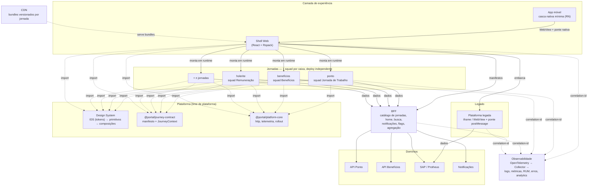

# Portal Pessoas — Proposta de arquitetura

> Parte 1 do case. A Parte 2 (implementação) está em [`../README.md`](../README.md).

---

## Princípios que guiaram todas as decisões

Antes de escolher tecnologia, fixei quatro princípios. Toda decisão abaixo é derivada deles, e sempre que houve conflito, a ordem de prioridade foi esta:

| # | Princípio | Por quê |
|---|---|---|
| 1 | **O core não pode crescer com o produto** | Com 10+ squads, qualquer coisa que exija mudar o shell vira fila. O shell precisa ser burro: ele monta e desmonta coisas, não sabe o que é "holerite". |
| 2 | **Acoplamento é permitido — desde que seja explícito, pequeno e versionado** | Microfrontend não elimina acoplamento, ele o move para um contrato. O ganho vem de o contrato ser minúsculo e estável. |
| 3 | **Falha de uma squad não pode virar falha do portal** | Deploys independentes significam incidentes independentes. Isolamento de falha não é um extra, é a condição para autonomia. |
| 4 | **Reuso vem da camada mais estável, não da mais visível** | Compartilhar tokens e regra de negócio é barato e dura anos. Compartilhar componente de UI entre DOM e nativo é caro e envelhece mal. |
| 5 | **Não reconstruir o que a casa já tem** | O Itaú já tem Design System. Portal interno que cria a própria paleta gera duas identidades da marca em dois anos. |

---

## 1. Arquitetura de alto nível



**O fluxo, em uma frase:** o shell pergunta ao BFF *quais jornadas existem para este colaborador*, recebe manifestos, valida cada um contra um schema, e monta em runtime — moderna via Module Federation, legada via iframe com ponte. O shell nunca importa uma jornada em tempo de build.

### O manifesto é o coração da solução

```jsonc
{
  "id": "beneficios",
  "squad": "squad-beneficios",
  "kind": "remote",                 // remote | legacy | native
  "version": "1.9.0",
  "route": "/beneficios",
  "entry": "https://cdn.../beneficios/1.9.0/remoteEntry.js",
  "rollout": { "enabled": true, "percentage": 20, "fallbackJourneyId": "beneficios-legado" }
}
```

Publicar uma jornada nova = adicionar um registro. Sem commit no shell, sem build do shell, sem deploy do shell. É isto que atende ao requisito *"inclusão de novas jornadas sem necessidade de alterar o core"* de forma literal, e não retórica.

---

## 2. Estratégia Web + Mobile

### Decisão

**Casca nativa mínima em React Native + jornadas renderizadas como web dentro de uma WebView, com ponte tipada para os recursos do dispositivo. Jornadas que dependem de hardware crítico saem da WebView e viram tela nativa — exceção justificada, não regra.**

### O que fica em cada lado

| Camada | Responsável | Conteúdo |
|---|---|---|
| **Nativa (RN)** | Time de plataforma mobile | Autenticação e biometria, armazenamento seguro do token, push notifications, deep links, câmera/GPS, cache offline, splash, navegação raiz por abas, atualização OTA |
| **Ponte JS ↔ nativo** | Time de plataforma | `postMessage` tipado: sessão, tema, geolocalização, biometria, telemetria, navegação |
| **Compartilhado** | Todos | Tokens do DS, regra de negócio, cliente HTTP, telemetria, contratos TS, **as jornadas inteiras** |
| **Nativa por exceção** | Squad dona | Jornadas com dependência forte de hardware ou uso offline pesado (`kind: "native"` no manifesto) |

### Por que não as alternativas

| Abordagem | Prós | Contras | Veredicto |
|---|---|---|---|
| **App 100% nativo (Swift/Kotlin)** | Melhor performance e sensação de nativo | Duplica **todas** as jornadas × 3 plataformas. Com 10 squads, cada uma precisaria de 3 especialistas | Inviável na escala de squads exigida |
| **React Native puro (UI nativa em todas as jornadas)** | Boa UX, uma base para iOS+Android | Ainda são **duas** implementações de UI (web e RN) para cada jornada. Module Federation em RN (Re.Pack) é imaturo e ninguém no mercado tem tanta gente sênior de RN | Rejeitado: o custo recai sobre as 10 squads, não sobre a plataforma |
| **PWA puro, sem app** | Reuso máximo, um deploy | Sem push confiável no iOS, sem biometria, sem distribuição em loja. Um portal de RH precisa de push ("seu ponto está pendente") | Rejeitado |
| **WebView 100%, casca só embrulhando** | Simples | Vira "site dentro de app": sem offline, sem biometria, sem integração — a reclamação clássica | Rejeitado |
| **✅ Casca nativa mínima + WebView com ponte** | Uma implementação de jornada serve web e app. A squad de produto **não precisa saber mobile**. Recursos nativos disponíveis por contrato | WebView é mais lenta que nativo. Exige investimento sério em performance web (a mesma que beneficia o web). Sensação de nativo depende de disciplina de UX | **Escolhida** |

### Como reduzimos duplicação, na prática

1. **Tokens compartilhados de verdade.** `tokens.json` é a única fonte; gera CSS custom properties para o web e um objeto JS para o RN. Não existe "azul do app" e "azul do site".
2. **Regra de negócio em pacotes TS agnósticos.** Validação, cálculo, mapeamento de API não importam `react` nem `react-native`. Rodam nos dois.
3. **A jornada em si é escrita uma vez.** Ela roda no shell web e, sem alteração, dentro da WebView.
4. **Duas bibliotecas finas de componente** (web e RN), ambas dirigidas pelos mesmos tokens, com o mesmo nome de API.

> **Trade-off que assumo explicitamente:** não uso `react-native-web` para ter uma única biblioteca de componentes. Ele parece resolver o problema, mas obriga o **web** a adotar as primitivas do RN — perde-se semântica HTML, acessibilidade nativa do browser e SSR fica caro. Prefiro duplicar ~30 componentes visuais finos (custo do time de plataforma, uma vez) a degradar a experiência web de 40 mil pessoas (custo de todos, sempre).

---

## 3. Estratégia para múltiplas squads

### Como uma squad publica

```
1. squad faz merge na sua branch principal
2. CI (template compartilhado) roda: lint · tipos · testes · a11y · orçamento de bundle
3. build (Rspack) → publica em  cdn/<jornada>/<versão-semver>/remoteEntry.js   (imutável)
4. PATCH no registro:  { "version": "1.9.0", "rollout": { "percentage": 5 } }
5. observa dashboards da própria jornada; sobe o percentual ou reverte
```

Reverter é mudar um número no registro. Não é rebuild, não é redeploy, não é chamar o time de plataforma às 2h da manhã.

### Como evitamos conflito entre squads

| Risco | Mecanismo |
|---|---|
| Duas squads mexendo no mesmo código | Uma jornada = um repositório (ou um pacote do monorepo) com `CODEOWNERS`. Sem código compartilhado entre jornadas — se duas precisam da mesma coisa, ela sobe para a plataforma via RFC |
| Colisão de rota | O `route` do manifesto é único e validado no CI do registro |
| Colisão de CSS | Componentes do DS usam prefixo `ds-`; jornadas usam CSS Modules com hash. Nenhuma regra de elemento global é permitida |
| Divergência de versão de dependência compartilhada | A lista `shared` do Module Federation é **curta e governada**: `react`, `react-dom`, DS, tokens. Renovate abre PR automático em todas as jornadas quando a plataforma sobe uma versão |
| Manifesto malformado derrubando o portal | Validação com Zod **em runtime**, no shell. Manifesto inválido derruba só a própria jornada e gera alerta para o dono |

### Versionamento

- **Contrato (`@portal/journey-contract`):** SemVer estrito. *Major* só com janela de suporte N-2 (o shell aceita duas majors ao mesmo tempo) e codemod publicado junto. O shell valida `contractVersion` antes de montar e recusa incompatíveis com mensagem clara.
- **Design System:** SemVer. *Major* no máximo duas vezes por ano, sempre com codemod.
- **Jornadas:** SemVer no bundle. URL do CDN é **imutável por versão** — nada de `latest`, senão cache e rollback viram loteria.

### Governança técnica — o mínimo que funciona

- **Golden path.** `npx create-jornada` gera repositório com CI, contrato, DS, telemetria e testes já ligados. A maioria das squads nunca precisa opinar sobre build.
- **Guilda de frontend.** Um representante por squad, quinzenal. Decide o que sobe para a plataforma.
- **ADRs versionados** no repositório da plataforma (exemplos em [`adr/`](adr/)).
- **Portões de qualidade no CI** — iguais para todos, herdados do template: cobertura mínima, orçamento de bundle por jornada, `axe` sem violações críticas, tipos sem `any` implícito.
- **Fitness functions.** O CI do shell falha se alguém adicionar um `import` estático de uma jornada. É a regra do princípio nº 1 codificada, não combinada em reunião.

### Como o shell não vira gargalo

Este é o ponto que decide se a arquitetura funciona ou não em 18 meses.

1. **O shell não conhece jornada nenhuma.** Não há `if (id === 'ponto')` em lugar algum. O catálogo, as rotas, os ícones e o menu vêm do registro.
2. **Capacidades entram pelo manifesto, não por código.** Quer aparecer na busca? Declare `capabilities: ["search"]`. O shell não muda.
3. **O que o shell oferece é contrato, não função.** Se uma squad precisa de algo novo do shell, isso vira RFC e entra no contrato — o que é intencionalmente burocrático, para o contrato crescer devagar.
4. **Time de plataforma tem produto próprio**, com backlog e SLO — não é um balcão de atendimento das outras squads.

---

## 4. Microfrontends: decisão e trade-offs

### Decisão

**Sim, microfrontends — via Module Federation com remotes resolvidos em runtime a partir do registro do BFF, dentro de um monorepo para os pacotes de plataforma.**

É um híbrido deliberado:

- **Monorepo** para o que é compartilhado e muda pouco: contrato, DS, tokens, platform-core. Assim a mudança do DS é testada contra todo mundo no mesmo PR.
- **Composição em runtime** para as jornadas, que mudam muito e têm donos diferentes.

### Implementação: Rspack

Module Federation é um *modelo*; ele precisa de uma implementação. A escolhida é
**Rspack + `@module-federation/enhanced`** — a implementação de referência da especificação,
mantida pelo mesmo time que mantém o Module Federation.

A primeira versão deste projeto usou Vite com um plugin de federação da comunidade e
esbarrou em dois problemas que não são de gosto:

- **Federação não valia em `dev`.** Os remotes só federavam depois de `build`; em
  desenvolvimento o shell carregava a própria cópia do React. O modo em que as 10 squads
  passam o dia não era o modo que ia para produção, e toda classe de bug de singleton
  (dois Reacts, hooks quebrados) só aparecia depois do merge.
- **O registro dinâmico de remote dependia de uma API não documentada** (o módulo virtual
  `__federation__` do plugin). A peça que sustenta "publicar jornada sem tocar no core"
  era a apoiada no alicerce mais frágil.

Com Rspack, `registerRemotes()` e `loadRemote()` são API pública e tipada, e o dev server já
federa com HMR. O detalhamento, incluindo o que se perdeu na troca, está na
[ADR 0006](adr/0006-rspack-como-bundler.md).

A lista `shared` — o único ponto em que 10 squads precisam concordar em tempo de build —
mora em **um** pacote (`@portal/build-preset`) e não copiada em N configs. Ele também deriva
o nome do container federado do `id` do manifesto, dos dois lados, o que elimina por
construção a divergência "o shell registra `ponto`, o bundle se anuncia como `app`".

### Por que não as alternativas

| Opção | Prós | Contras | Por que não |
|---|---|---|---|
| **Monolito modular (uma SPA, pastas por domínio)** | Simples, rápido, sem custo operacional. Melhor performance | Um deploy para todos. Fila de release entre 10 squads. Um teste flaky de uma squad trava as outras nove | Não atende "deploy independente por domínio". *Seria minha escolha para 2–3 squads* |
| **Pacotes npm versionados** | Isolamento em build time, tipos de ponta a ponta, sem custo de runtime | Publicar jornada exige **bump + build + deploy do shell**. O shell vira o gargalo de todos | Viola o princípio nº 1. Ótima opção intermediária se a organização ainda não tiver maturidade de plataforma |
| **iframes para tudo** | Isolamento perfeito, funciona com qualquer stack | Navegação, histórico, foco, acessibilidade e altura viram problema permanente. UX ruim | Usado **só** para o legado, onde o isolamento vale o preço |
| **Web Components** | Padrão do browser, agnóstico de framework | Shadow DOM briga com o DS e com CSS custom properties herdadas; SSR difícil; ergonomia ruim com React | Rejeitado |
| **single-spa** | Maduro, orquestração de ciclo de vida robusta | Traz orquestrador próprio; ainda precisaria resolver compartilhamento de dependência (import maps) | Alternativa legítima. Module Federation resolve carregamento *e* compartilhamento na mesma peça |
| **✅ Module Federation (runtime, remotes dinâmicos)** | Deploy independente real; dependências compartilhadas como singleton; shell não conhece as jornadas | Complexidade operacional real; falha de rede vira falha de tela; depurar produção exige source maps e disciplina; risco de divergência de versão nos `shared` | **Escolhida** |

### Os trade-offs, item por item (como o case pede)

**Autonomia dos times — ganho grande.** Cada squad escolhe seu ritmo, sua stack interna e seu rollout. O limite é o contrato.

**Complexidade operacional — é o custo real.** Passamos de 1 pipeline para N+1. Exige CDN com versionamento imutável, registro com API, e um time de plataforma dedicado. **Se a empresa não puder bancar um time de plataforma, esta arquitetura falha** — e a resposta correta passa a ser pacotes versionados. Digo isso porque é a causa mais comum de fracasso de microfrontend, e não a tecnologia.

**Performance — o ponto fraco, mitigado assim:**
- `react`, `react-dom` e o DS como singletons compartilhados (evita baixar React 4 vezes).
- Prefetch da jornada no `hover`/`focus` do item do menu — o download começa antes do clique.
- Orçamento de bundle por jornada no CI (ex.: 180 KB gzip); estourar quebra o build do time dono.
- Cache do módulo por `id@versão`: navegar entre jornadas na mesma sessão não rebaixa nada.
- O shell renderiza *chrome* + skeleton imediatamente; o colaborador nunca vê tela branca.
- O `dev` server federa e compartilha singletons igual à produção, então regressão de
  performance por dependência duplicada aparece na máquina de quem escreveu, e não na
  esteira.

**Governança — o custo se desloca.** Sai o custo de merge conflict, entra o custo de manter contrato e versão. É um custo menor e concentrado no time de plataforma, em vez de espalhado por 10 times.

**Reuso — preservado pelo monorepo de plataforma.** DS, tokens e regra transversal continuam em um lugar só.

**Evolução futura — é o principal ganho.** Como o contrato é `mount(container, ctx)` e não "exporte um componente React", uma squad pode migrar sua jornada para outro framework sem tocar no shell nem nas outras jornadas. É a apólice de seguro contra a próxima virada de tecnologia.

> **O que perdemos com o contrato agnóstico:** tipagem de props ponta a ponta, Suspense e Context compartilhados, e uma árvore React única. Aceitei essa perda porque o requisito de *"substituição futura de tecnologias com impacto controlado"* é explícito no case, e porque a árvore separada é justamente o que dá isolamento de falha.
>
> **A ressalva que essa frase esconde, e que custou caro descobrir:** árvore separada dá
> isolamento de *processo*, não de *tela*. Error boundary do React não atravessa fronteira
> de raiz — um erro dentro da jornada desmontava a árvore da squad e deixava um retângulo
> **vazio**, sem mensagem e sem retry, enquanto o resto do portal seguia vivo. Do ponto de
> vista de quem usa, isso é indistinguível de "travou". O contrato foi para 1.1 com
> `ctx.fail(error)`: a squad captura na tecnologia dela e devolve o controle ao shell, que
> desenha a mesma superfície degradada para as 10 jornadas. Ver
> [ADR 0007](adr/0007-falha-de-render-atravessa-fronteira-de-raiz.md).

---

## 5. Design System

### Decisão

**O portal não constrói um Design System próprio. Ele adota o Itaú Design System (IDS) como camada L0 e constrói acima dele.**

Essa é a decisão mais fácil de errar num portal interno: como ele "não é produto de cliente", o time acaba criando cores e componentes próprios, e em dois anos existem duas identidades Itaú. O IDS já resolve marca, acessibilidade e paridade web/mobile — reconstruir isso seria criar uma segunda fonte de verdade.

### Estrutura em camadas

| Camada | Pacote | Dono | Conteúdo | Cadência |
|---|---|---|---|---|
| **L0 — Tokens de marca** | **IDS** (`@itau/design-system`) | Time de Design System do Itaú | `--ids_color_*`, `--ids_spacing_*`, `--ids_textStyle_*` | Fora do nosso controle |
| **L0.5 — Alias semântico** | `@portal/tokens` | Plataforma do portal | traduz `ids_color_bg_base` → `c-bg-surface` | Rara |
| **L1 — Primitivos** | `@portal/design-system` | Plataforma | `Button`, `Text`, `Field`, `Badge` | Baixa |
| **L2 — Composições** | `@portal/design-system` | Plataforma (contribuição federada) | `Card`, `DataList`, `EmptyState` | Média |
| **L3 — Negócio** | `@portal/<domínio>-ui` | **A squad do domínio** | `CartaoDeBeneficio`, `EspelhoDePonto` | Alta |

### Por que existe a camada de alias (L0.5)

Poderíamos consumir `--ids_color_action_primary_base` direto nos componentes. Não fazemos, por três motivos:

1. **Legibilidade.** `--c-accent-bg` diz o papel no produto; `--ids_color_action_primary_base` diz o papel na marca. Quem entra na squad amanhã lê o primeiro sem decorar o IDS.
2. **Raio de impacto de uma major do IDS.** Se o IDS renomear ou reorganizar tokens, muda-se **um mapa** — não 200 arquivos espalhados por 10 repositórios de squad.
3. **Governança visível.** O que o portal precisou e o IDS não cobre fica isolado em um bloco `extras` de três linhas (sombra de card, raio pill, fonte monoespaçada). Cada item ali é candidato a RFC para o time de DS. Sem esse bloco, as exceções nascem espalhadas e ninguém nunca as devolve.

O arquivo gerado não contém **nenhum valor de cor** — só `var(--ids_*)`. Consequência prática: quando o time do IDS publicar uma versão nova, o portal inteiro e todos os microfrontends acompanham **sem rebuild de nenhuma jornada**, porque as variáveis são resolvidas pelo browser em runtime, herdadas do documento do shell.

### Compatibilidade entre web e mobile

- **Web e WebView:** custom properties do IDS, herdadas pelo documento.
- **React Native:** RN não lê custom properties, então `@portal/tokens/native` expõe os mesmos nomes semânticos com valores resolvidos. Em produção isso vem do pacote nativo oficial do IDS; o mapa de nomes é idêntico ao do web.

Efeito colateral elegante do modelo: como o tema é feito de custom properties no `:root`, **trocar de claro para escuro repinta todas as jornadas sem uma linha de código nas squads** — inclusive as carregadas por Module Federation e o legado dentro do iframe, que recebe o tema pela ponte.

> **Ressalva honesta sobre o tema escuro:** o recorte de tokens que usei no case não inclui o tema escuro oficial do IDS (distribuído por classe `ids-theme-*`). Implementei uma aproximação derivada do azul de marca, isolada em um único bloco `darkOverrides`, justamente para que trocá-la pelo tema oficial seja apagar dezoito linhas.

### Versionamento e governança

- **IDS:** consumido por SemVer, com Renovate abrindo PR em todas as jornadas quando sai versão nova.
- **`@portal/design-system`:** SemVer. *Major* no máximo 2×/ano, sempre com codemod publicado. Suporte N-1 garantido — nenhuma squad é obrigada a migrar no mesmo sprint.
- **Modelo federado de contribuição:** a squad abre PR no DS do portal; a plataforma revisa e mantém. Um componente só entra em L2 depois de aparecer em **três** jornadas diferentes — antes disso, é L3. Esta regra dos três usos é o que evita o DS virar depósito.
- **Fluxo de exceção:** se uma squad precisa de algo que o IDS não tem, o caminho é RFC para o IDS, e o `extras` é solução temporária com dono e prazo. Sem esse fluxo, o portal reinventa o IDS por acúmulo.
- Storybook interno + regressão visual (Chromatic) obrigatórios em PR; regra de ESLint bloqueando hex e px cru fora do pacote de tokens.

### Adoção pelas squads

O `create-jornada` já vem com IDS, tokens e DS instalados e configurados. Adoção não é campanha de convencimento — é o caminho de menor esforço. Complementarmente: dashboard de adoção (% de componentes do DS vs. componentes próprios, e nº de exceções em `extras` por jornada) revisado na guilda.

### Nota sobre as fontes

"Itau Display", "Itau Text" e "Itau Icon" são proprietárias e não acompanham o repositório do case. As famílias são declaradas com fallback de sistema, e as métricas de tamanho e entrelinha vêm dos tokens — então, ao adicionar os `@import` oficiais do IDS dentro da rede, **o layout não muda: só a face muda.**

## 6. Estratégia de migração — *strangler fig*

### Conviver com o legado

O legado entra no portal por **iframe (web) / WebView (app)** com uma ponte `postMessage` de ~40 linhas injetada no template antigo. Ela resolve: altura, sessão, tema, navegação e telemetria.

**Por que iframe e não Module Federation para o legado:** o legado tem CSS global e provavelmente jQuery. Federar isso contamina o portal inteiro. O iframe dá isolamento de CSS, JS e erro de graça, **sem tocar no código antigo** — que é a única forma de conviver com o legado sem antes refatorá-lo. O preço (acessibilidade, foco, histórico) é real, e por isso o iframe é tratado como estado transitório com data de validade, não como arquitetura.

### Migrar sem big bang — quatro fases por jornada

| Fase | O que acontece | Como o colaborador vê |
|---|---|---|
| **1. Envelopar** | Legado entra no iframe, com header/menu/busca do portal | Já ganha navegação e busca unificadas; o miolo ainda é antigo |
| **2. Fatiar** | A squad reescreve uma tela de cada vez. Rota a rota, o registro aponta ora para o moderno, ora para o legado | Transição imperceptível: mesma URL, mesmo menu |
| **3. Rollout** | `percentage` sobe: 1% → 5% → 25% → 50% → 100%, com bucket estável por matrícula | Cada pessoa fica sempre na mesma versão — nada de trocar de tela a cada login |
| **4. Desligar** | Legado removido do registro e a rota antiga passa a redirecionar | Nada muda |

### Redirecionar para jornadas ainda não modernizadas

O colaborador nunca vê a diferença: **todas** as jornadas — modernas e legadas — são itens do mesmo catálogo, na mesma navegação, com a mesma URL do portal. O `kind` do manifesto decide como montar; isso é detalhe de implementação, não de experiência.

### Controlar o rollout

- Percentual + allowlist por perfil (canary interno primeiro: o próprio RH e TI).
- Bucket determinístico por `hash(matrícula + jornada)`: mesma pessoa, mesma versão, sempre.
- **`fallbackJourneyId`** é o kill switch: se o bundle moderno falhar ao carregar, o shell oferece a versão anterior na hora — o colaborador não fica sem serviço.
- O mesmo cálculo roda no cliente, então a reversão não depende de propagação de cache no CDN.

### Medir o avanço

| Métrica | Como | Para quê |
|---|---|---|
| % de sessões por jornada em versão moderna | evento `jornada.montada` com `kind` | Progresso real da migração |
| Conclusão de tarefa: moderno vs. legado | funil por `journey.id` + `version` | Provar que o novo é melhor antes de subir o percentual |
| Erro e p95 de carregamento por jornada | `jornada.tempo_de_montagem`, `journey.error` | Critério objetivo de "pode subir para 50%?" |
| Chamados no service desk por jornada | integração com o ITSM | O indicador que a diretoria olha |
| Nº de rotas ainda em `kind: legacy` | consulta ao registro | Burndown da migração, sem planilha |

### Evitar impacto na experiência

- Mesma URL antes e depois: link antigo em e-mail continua funcionando.
- Skeleton do DS enquanto a jornada carrega — nunca tela branca.
- Erro de uma jornada não derruba menu, busca nem notificações.
- Nenhuma migração forçada durante fechamento de folha (janela de congelamento acordada com RH).

---

## 7. Observabilidade

O ponto que sustenta tudo: **um `correlation-id` gerado no shell no início da sessão**, propagado para toda jornada, para o legado pela ponte, e para o BFF e as APIs por header. Quando alguém abre chamado, o número na tela de erro reconstrói a sessão inteira.

| Sinal | Ferramenta | Recorte |
|---|---|---|
| **Logs** | OpenTelemetry Web → Collector | `correlationId`, `sessionId`, `journeyId`, `squad`, `version` |
| **Métricas** | Prometheus / Datadog | p50/p95 de montagem, taxa de erro e Web Vitals **por jornada e por versão** |
| **Erros** | Sentry | Source maps por versão; alerta roteado para o dono via `squad` |
| **Analytics** | Esquema de eventos tipado no `platform-core` | Funil por jornada; comparação moderno × legado |
| **Rastreabilidade** | Trace distribuído | shell → jornada → BFF → API de domínio, no mesmo trace |

Duas decisões que fazem diferença na prática:

1. **Telemetria é da plataforma, não de cada squad.** Se cada time escolhesse sua lib, ninguém conseguiria responder *"a jornada de férias está lenta ou o portal inteiro está lento?"*.
2. **Todo evento nasce carimbado com squad e versão.** É isso que permite alertar o time certo automaticamente e comparar versões durante o rollout. Sem esse carimbo, o dashboard mostra "o frontend está com erro" — informação inútil quando há 10 times.
3. **A mensagem técnica e a mensagem da tela são coisas diferentes.** O runtime de federação
   devolve `#RUNTIME-008 ... View the docs to see how to solve: https://module-federation.io/…`.
   Isso é texto para quem mantém o portal, e estava indo direto para a tela de 40 mil pessoas —
   com link para a documentação de um bundler. O erro técnico continua existindo e vai
   **inteiro** para a telemetria, com jornada, squad, versão e `correlation-id`; a tela recebe
   uma frase e o código de rastreio. O que muda não é a informação, é quem lê cada uma.

---

## 8. Riscos assumidos e o que eu faria diferente

Sendo honesta sobre os limites da proposta:

| Risco | Probabilidade | Mitigação |
|---|---|---|
| **O BFF virar o novo monolito compartilhado** | Alta | Um módulo por domínio com `CODEOWNERS` por pasta desde o dia 1. Se o custo de coordenação superar o custo operacional, migrar para GraphQL Federation com um subgraph por domínio |
| **Performance da WebView no app** | Média | Orçamento de bundle no CI, prefetch da casca, cache agressivo e OTA. Se não atingir a meta, jornadas críticas viram `kind: native` — o manifesto já prevê isso |
| **Empresa não bancar time de plataforma** | Média | O plano B é assumido: comece com **pacotes versionados em monorepo**. O contrato `mount/ctx` continua idêntico, então a migração para Module Federation depois é incremental |
| **Contrato inchar com o tempo** | Alta | RFC obrigatória e revisão semestral do contrato para remover o que não é usado. Contrato que só cresce é acoplamento disfarçado |
| **iframe do legado degradar acessibilidade** | Certa | Aceita como estado transitório com prazo. Auditoria de a11y só nas jornadas modernas; legado sai do ar por data, não por perfeição |

**Se eu tivesse 2 semanas para começar**, não começaria pelos microfrontends. Começaria por: tokens + DS + contrato + BFF + shell com **uma** jornada, e o legado inteiro no iframe. Isso já entrega navegação e busca unificadas para o colaborador na primeira release, e prova a arquitetura antes de espalhar o custo para 10 squads.

---

## 9. Roadmap sugerido

| Trimestre | Entrega | Como sabemos que deu certo |
|---|---|---|
| **T1** | Tokens, DS L0–L2, contrato, BFF, shell, legado envelopado | Colaborador acessa tudo por uma navegação só |
| **T2** | 2 jornadas modernas em rollout; observabilidade completa; `create-jornada` | Duas squads publicando sem tocar no shell |
| **T3** | App com casca nativa + WebView; push; biometria | Paridade de jornadas entre web e app |
| **T4** | 5+ squads; DS federado; 50% das jornadas modernas | Tempo de lead de uma jornada nova < 1 sprint |
