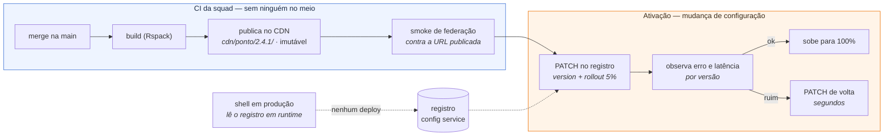

# Build e deploy de um módulo apartado

> Complementa a [Parte 1, §3](01-proposta-tecnica.md#3-estratégia-para-múltiplas-squads), que
> resume o fluxo em cinco linhas. Aqui está o detalhe operacional: o que a squad publica, onde
> aquilo mora, quem aperta o botão, o que acontece quando dá errado — e onde a independência
> entre times **acaba**.

---

## A ideia que faz o resto funcionar

**Publicar o artefato e ativá-lo são dois atos separados, com riscos diferentes.**

Se essa separação não existe, "deploy independente" é só uma palavra: mesmo com dez bundles
distintos, ninguém sobe nada sem janela, porque publicar *é* colocar no ar.

| | Publicar | Ativar |
| --- | --- | --- |
| O que é | subir arquivos imutáveis num CDN | mudar um número num registro |
| Quem vê | ninguém | os colaboradores do rollout |
| Reversível em | não precisa (nada mudou) | segundos, sem rebuild |
| Precisa de janela | não | não |
| Bloqueia outra squad | não | não |

É isso que responde "como subir um módulo apartado": a squad publica quando quiser, e ativa
quando quiser — dois eventos que nem precisam ser no mesmo dia. O portal em produção continua
servindo a versão anterior até que alguém mude o registro, e ninguém além da squad dona
precisa saber que houve um build.



---

## 1. O artefato: o que uma jornada publica

`npm run build` de uma jornada gera um diretório e nada além dele:

```
dist/
  remoteEntry.js                          # o container: o que o shell baixa primeiro
  chunk.__federation_expose_journey.*.js  # o módulo ./journey
  chunk.*.js  chunk.*.css                 # o resto do código da squad
  mf-manifest.json                        # o que este bundle expõe e compartilha
```

Três propriedades importam, e as três vêm do
[`@portal/build-preset`](../packages/build-preset/src/index.mjs) — não da squad:

**O nome do container é derivado do `id` do manifesto.** `containerNameOf('ponto')` roda no
build e no runtime do shell, a partir do
[mesmo arquivo](../packages/build-preset/src/container-name.mjs). A classe de erro "o shell
registrou `ponto` e o bundle se anunciou como `app`" não existe.

**O `publicPath` decide de onde os chunks são baixados.** Sem ele, seriam resolvidos a partir
da origem **do shell**, e a jornada quebraria só em produção. Há duas formas de resolver, e a
diferença importa mais do que parece:

```bash
# absoluto: o endereço entra no bundle
JOURNEY_PUBLIC_PATH=https://cdn.portal.itau/jornadas/ponto/2.4.1/ npm run build

# 'auto': o Rspack resolve em runtime, a partir do src do próprio remoteEntry
JOURNEY_PUBLIC_PATH=auto npm run build
```

As jornadas React usam o absoluto; a jornada em Angular usa `'auto'`, e virou o padrão dela
no `angularJourneyConfig`. A razão não foi teórica: **ela é publicada num endereço que só se
conhece depois do deploy** (ver §12), então não havia como embutir a URL no bundle.

Com `'auto'` o artefato fica **portátil**: os mesmos bytes servem de `localhost:5005`, do
preview de um PR e do CDN de produção. Isso reforça o que a §5 defende — promover artefato em
vez de reconstruir — e remove a única razão legítima que aquela seção admitia para rebuildar
por ambiente. O preço é que o bundle deixa de declarar de onde veio; quem quiser essa
amarração explícita continua com o `JOURNEY_PUBLIC_PATH` absoluto.

Em qualquer um dos dois casos a **URL de publicação continua imutável por versão** — isso é
propriedade do CDN e do processo, não do bundle.

**A lista `shared` mora em um lugar só.** É o único ponto onde dez squads precisam concordar
em tempo de build, e ele tem dono (plataforma). Uma squad que suba React 19 sozinha colocaria
dois Reacts na mesma página; com a lista centralizada, isso não é disciplina, é impossível de
fazer sem abrir PR no pacote da plataforma.

---

## 2. Onde o artefato mora

```
cdn.portal.itau/jornadas/
  ponto/2.4.0/remoteEntry.js        ← continua no ar; é o alvo do rollback
  ponto/2.4.1/remoteEntry.js        ← recém-publicado
  beneficios/1.9.0/remoteEntry.js
  teste-angular/0.1.0/remoteEntry.js
```

**Um prefixo por jornada, uma pasta por versão, e nada de `latest`.** URL imutável por versão
não é preciosismo de nomenclatura: com `latest`, cache de CDN e rollback viram loteria, e a
pergunta "qual versão o colaborador estava usando quando o erro aconteceu" deixa de ter
resposta.

Versões antigas não são apagadas no deploy seguinte. Elas são o rollback — apagar a anterior
é destruir o plano de contingência para economizar centavos de storage. Limpeza é por
retenção (as N últimas, ou 90 dias), nunca por publicação.

**Cabeçalhos.** Os dois lados desta divisão têm políticas opostas, e trocá-las quebra a
arquitetura:

| Recurso | Cache | Por quê |
| --- | --- | --- |
| `jornadas/<id>/<versão>/*` | `max-age=31536000, immutable` | o conteúdo nunca muda para aquela URL |
| resposta do registro | `no-store` (ou TTL de segundos) | é o que torna a ativação e o rollback imediatos |

Um registro com cache longo transforma "rollback em segundos" em "rollback quando o CDN
deixar", que é a diferença entre um incidente de dois minutos e um de duas horas.

**CORS e CSP.** Federação é cross-origin por definição: o shell em `portal.itau` baixa script
de `cdn.portal.itau`. Dois pontos que costumam ser descobertos tarde:

- o CDN precisa responder `Access-Control-Allow-Origin` para a origem do portal — o
  `build-preset` já faz isso no dev server, e o mesmo tem de valer no bucket;
- a **CSP do shell** precisa ter a origem do CDN em `script-src`. É o item mais fácil de
  esquecer, porque não aparece em desenvolvimento: se `script-src` for restritivo, a jornada
  nova é bloqueada pelo browser e o sintoma chega ao shell como
  "jornada não respondeu" — indistinguível de CDN fora do ar. Eu trataria a lista de origens
  permitidas como parte do contrato de plataforma, revisada quando um CDN novo entra, e não
  como configuração de infraestrutura de um time só.

---

## 3. O pipeline da squad

Herdado de um template compartilhado, não copiado. A squad não escreve pipeline; ela declara
o `id` da jornada.

Esboço — não existe `.github/` neste repositório:

```yaml
# .github/workflows/publicar.yml — template de plataforma
on:
  push: { branches: [main] }

jobs:
  qualidade:
    steps:
      - run: npm ci
      - run: npm run lint
      - run: npm run typecheck
      - run: npm test
      - run: npx axe-ci                     # a11y: mesmo portão para todas as squads
      - run: npm run build -- --analyze     # falha se estourar o orçamento de bytes

  publicar:
    needs: qualidade
    steps:
      - id: v
        run: echo "versao=$(jq -r .version package.json)" >> $GITHUB_OUTPUT

      # 1. o endereço final entra no bundle
      - run: JOURNEY_PUBLIC_PATH=$CDN/jornadas/$JORNADA/${{ steps.v.outputs.versao }}/ npm run build

      # 2. imutável: publicar duas vezes a mesma versão é erro, não sobrescrita
      - run: aws s3 cp dist/ $BUCKET/jornadas/$JORNADA/${{ steps.v.outputs.versao }}/ --recursive
        # --if-none-match equivalente; o job falha se o prefixo já existir

      # 3. o portão que importa: o artefato PUBLICADO monta?
      - run: node scripts/smoke-federacao.mjs $CDN/jornadas/$JORNADA/${{ steps.v.outputs.versao }}/remoteEntry.js
```

### O smoke de federação é o portão que não pode faltar

Todo o resto do CI testa o código. Este testa **o artefato no endereço em que ele vai ser
consumido** — que é onde mora a classe de falha específica desta arquitetura:

```js
// baixa o remoteEntry publicado, registra como o shell registra, e monta
registerRemotes([{ name: containerNameOf(id), entry: url, type: 'global' }], { force: true });
const journey = await loadRemote(`${containerNameOf(id)}/journey`);

assert(isContractCompatible(journey.contractVersion));  // contrato v1.x?
assert(typeof journey.mount === 'function');            // exporta mount?
const unmount = await journey.mount(document.createElement('div'), ctxFalso);
assert(typeof unmount === 'function');                  // devolve o desmonte?
unmount();
```

Sem ele, "publiquei num formato que o portal não reconhece" (`RUNTIME-002`) chega ao
colaborador como tela de erro. Com ele, chega ao CI como build vermelho. Repare que o teste
não menciona React, Angular ou bundler: ele é agnóstico de framework por construção, e por
isso vale igual para a jornada em Angular ([ADR 0012](adr/0012-admitir-um-segundo-framework.md)).

Este projeto ainda **não tem** esse script no repositório — o equivalente foi executado à mão
ao validar a jornada Angular. É o primeiro item que eu levaria para um CI de verdade.

---

## 4. A ativação: o registro

O [`registry.json`](../apps/bff/src/registry.json) deste repositório é a versão didática de
uma **tabela com API própria** em produção. Ativar uma versão é:

```http
PATCH /admin/v1/journeys/ponto
{ "version": "2.4.1", "entry": "https://cdn.portal.itau/jornadas/ponto/2.4.1/remoteEntry.js",
  "rollout": { "percentage": 5 } }
```

Nenhum build. Nenhum deploy. Nenhum arquivo de outro time no PR.

O registro é o **único recurso compartilhado** de todo o fluxo, então ele é o único lugar que
precisa de governança de verdade:

- **autorização por jornada.** A squad de Benefícios só escreve na linha `beneficios`. Sem
  isso, o registro vira o gargalo que a arquitetura inteira existe para evitar — só que agora
  disfarçado de configuração.
- **validação na escrita**, com o mesmo schema Zod do
  [contrato](../packages/journey-contract/src/index.ts): rota única, `entry` numa origem
  permitida, SemVer válido, `id` casando com o container. Manifesto malformado é rejeitado no
  `PATCH`, não descoberto no browser do colaborador.
- **log de auditoria imutável.** Quem mudou o quê, quando, de qual valor para qual. Numa
  investigação de incidente, a primeira pergunta é sempre "o que mudou nos últimos 30
  minutos", e mudança de configuração é invisível se não for registrada como deploy.
- **campos de plataforma são somente leitura para a squad** — `requiredRoles` e a origem
  permitida em `entry` não podem ser editados por quem publica.

O shell, em produção, não participa disso: ele lê o registro em runtime, a cada carga de
página. É por isso que a lista de jornadas pode mudar sem que uma única linha de
`apps/shell/` seja tocada.

---

## 5. Ambientes: promover artefato, não reconstruir

O mesmo bundle atravessa os ambientes. Um artefato reconstruído para homologação e outro para
produção não são o mesmo software, e a diferença aparece justamente no dia ruim.

```
publica UMA vez  →  cdn/jornadas/ponto/2.4.1/
                     ├── registro de dev   → ativa 2.4.1 em 100%
                     ├── registro de hml   → ativa 2.4.1 em 100%
                     └── registro de prod  → ativa 2.4.1 em 5% → 25% → 100%
```

Promoção é uma escrita no registro do ambiente seguinte. Se o CDN for segregado por ambiente
(o normal num banco), o passo extra é uma **cópia de bytes** entre buckets, com a mesma
versão e o mesmo caminho — nunca um segundo build. O `JOURNEY_PUBLIC_PATH` passa a ser
resolvido por ambiente, e essa é a única razão legítima para rebuildar; se for o caso, o
pipeline gera os N artefatos **na mesma execução**, a partir do mesmo commit.

---

## 6. Preview por PR, dentro do portal de verdade

O que costuma faltar em microfrontends: revisar a jornada **dentro** do portal, e não isolada
em `localhost:5001`.

```
cdn/jornadas/ponto/pr-482/remoteEntry.js     ← publicado a cada push do PR
```

O shell **passaria a aceitar** um override de entrada por jornada, vindo de cookie ou query
string e restrito a ambientes que não sejam produção — não está implementado neste
repositório:

```
https://hml.portal.itau/ponto?__mf_ponto=https://cdn.../ponto/pr-482/remoteEntry.js
```

O `registerRemotes(…, { force: true })` que já sustenta o rollback é exatamente o mecanismo
que sustenta isso — é a mesma capacidade usada para outro fim. O revisor vê a jornada com o
menu, a busca, o tema e a telemetria reais, e as outras nove jornadas seguem nas versões de
homologação.

Duas regras: o override **nunca** vale em produção (é uma porta para carregar código
arbitrário no portal), e artefatos `pr-*` têm retenção curta.

---

## 7. Quando dá errado

Em ordem crescente de gravidade, e todas sem rebuild:

| Situação | Ação | Tempo |
| --- | --- | --- |
| Erro aparece no canary | `PATCH` `percentage: 0` | segundos |
| Versão nova está ruim | `PATCH` `version` para a anterior | segundos |
| Jornada instável, sem correção à mão | `PATCH` `rollout.enabled: false` — some do catálogo | segundos |
| Jornada tem equivalente legado | `fallbackJourneyId` já leva o colaborador para lá | automático |
| CDN fora do ar | `budget.loadTimeoutMs` estoura → tela degradada com rastreio e *retry* | automático |

As três últimas linhas já estão implementadas neste repositório
([ADR 0010](adr/0010-rollout-resolvido-tambem-no-cliente.md) e
[`JourneyHost.tsx`](../apps/shell/src/journeys/JourneyHost.tsx)) — o rollout é resolvido
**também no cliente** justamente para funcionar como kill switch quando o remote falha.

Para o rollback ser real, a telemetria precisa carregar `version` em todo evento — sem isso
não dá para comparar taxa de erro entre a versão nova e a anterior, e a decisão de reverter
vira opinião. É por isso que
[`telemetry.forJourney({ journeyId, squad, version })`](../packages/platform-core/src/telemetry.ts)
carimba os três em toda a instrumentação.

---

## 8. E o deploy do shell e do BFF?

O shell é o único artefato cujo deploy afeta todo mundo — e é exatamente por isso que ele
**não contém jornada nenhuma**. Ele publica navegação, tema, busca, o `JourneyHost` e o
runtime de federação. Ele sobe raramente, com o cuidado de um serviço central, e nunca porque
uma squad publicou algo.

A *fitness function* proposta para manter isso verdade: **o CI do shell falha se alguém
adicionar um `import` estático de uma jornada.** É a regra codificada, e não combinada em
reunião — sem ela, a primeira urgência reintroduz o acoplamento e ninguém percebe até o
próximo release travar. Este repositório não tem CI, então ela também está no papel; hoje o
que sustenta a regra é a ausência de qualquer `import` de jornada em `apps/shell/`, que dá
para verificar num `grep`.

O BFF sobe como qualquer serviço. Ele é dono do registro, mas mudar o registro não é subir o
BFF: o dado mora fora do artefato, e é essa separação que faz o `PATCH` ser barato.

---

## 9. Onde a independência acaba

Prometer independência total seria desonesto. São três os acoplamentos, todos conhecidos e
todos com política — o que muda de "risco" para "custo previsto":

**1. A lista `shared` (React, react-dom, DS, tokens).** Subir a major de um singleton exige
que todas as jornadas acompanhem. Política: `strictVersion: false`, para divergência de patch
degradar com aviso no console em vez de derrubar a jornada; Renovate abre PR em todas as
jornadas no mesmo dia; a plataforma mantém as duas majors no ar durante a janela de migração.

**2. A major do contrato.** O que já existe: o shell valida `contractVersion` **antes** de
montar e recusa incompatível com mensagem clara, em vez de deixar quebrar no meio do render
([`isContractCompatible`](../packages/journey-contract/src/index.ts)). O que é política, e
ainda não código: aceitar duas majors ao mesmo tempo (N e N-1) durante a janela de migração,
com codemod publicado junto — hoje `SUPPORTED_CONTRACT_MAJOR` é um número só, o que significa
que uma major do contrato exigiria as dez jornadas migrando na mesma janela. É o acoplamento
mais caro dos três, e o que eu resolveria primeiro.

**3. A major do Design System.** Resolvida por convivência, não por big bang: a v1 e a v2
moram no mesmo pacote, em subpaths diferentes, e a jornada migra tela a tela
([ADR 0011](adr/0011-design-system-v2-conviver-com-a-v1.md)). Há um arquivo neste repositório
com as duas versões renderizando na mesma árvore React.

Fora esses três, uma squad publica e ativa sem falar com ninguém — inclusive em outro
framework, o que a [ADR 0012](adr/0012-admitir-um-segundo-framework.md) mediu.

---

## 10. Monorepo ou um repositório por squad?

A pergunta que sempre vem junto. **A resposta não muda o deploy**, e é isso que importa: o
artefato, o registro e a ativação são idênticos nos dois casos, porque a fronteira é o
contrato e não o repositório.

| | Monorepo (como aqui) | Um repositório por squad |
| --- | --- | --- |
| Publicar só o que mudou | filtro de path no CI, ou `nx affected` | natural |
| Mudança no contrato ou no DS | um PR atravessa tudo, com CI provando | N PRs, propagação por versão de pacote |
| Onboarding | um clone | um clone por jornada |
| Risco | tentação de importar do vizinho — contida por `CODEOWNERS` e pela fitness function | divergência de tooling |

Este repositório é monorepo porque é um case: o avaliador precisa ler tudo de uma vez. Numa
organização com dez squads eu começaria monorepo com `CODEOWNERS` por diretório e sairia para
polirrepo apenas quando o tempo de CI, e não a política, passasse a doer.

---

## 11. O que eu mediria

Métrica de plataforma é o que impede a arquitetura de virar teatro:

- **frequência de deploy por squad** — se caiu, a independência virou nominal;
- **tempo entre merge e 100% de rollout**;
- **taxa de rollback** e **tempo até o rollback** (o segundo importa mais);
- **quantos deploys do shell foram causados por pedido de squad** — a meta é zero, e essa é a
  medida honesta de "o shell não é gargalo";
- **peso do bundle por jornada**, com orçamento declarado no manifesto e verificado no CI —
  hoje o manifesto declara só `budget.loadTimeoutMs`; orçamento de bytes é o item que falta.

---

## 12. Isto foi feito de verdade

A jornada em Angular foi publicada em produção, num provedor externo, para que este documento
não fosse só desenho. O que o exercício produziu:

**Publicação.** `npm run deploy -w @portal/journey-teste-angular` — build com `publicPath`
portátil, cópia dos artefatos para um diretório de deploy e envio para a Vercel. O
[`vercel.json`](../apps/journey-teste-angular/vercel.json) da jornada carrega exatamente as
duas políticas da §2: `Access-Control-Allow-Origin: *` para a federação cross-origin
funcionar, e cache imutável nos chunks com revalidação no `remoteEntry.js`.

**O que foi verificado, e não presumido:**

| Verificação | Resultado |
| --- | --- |
| `remoteEntry.js` público, sem parede de autenticação | `HTTP/2 200` |
| `access-control-allow-origin` na resposta | `*` |
| Container anunciado no bundle publicado | `teste_angular` — derivado do `id` do manifesto |
| Smoke de federação contra a URL pública | contrato v1.1, montou e desmontou limpo |
| Portal local carregando a jornada de produção | com o dev server da porta 5005 **parado** |
| Redeploy | mesma URL, artefato novo |

**A prova do deploy independente.** O `entry` da jornada no
[registro](../apps/bff/src/registry.json) passou a apontar para a URL de produção. O shell
não foi reconstruído, não foi reiniciado e não teve uma linha alterada — o BFF relê o registro
a cada requisição, e a jornada passou a vir de outro provedor, em outro domínio, na carga de
página seguinte. O rodapé da tela mostra a origem real:

```
carregada via module federation de https://…vercel.app/remoteEntry.js em 546ms
```

Esse rodapé é a diferença entre afirmar e demonstrar: o shell não sabe, e não precisa saber,
que aquele endereço mudou de `localhost` para um CDN externo.

**O que este exercício NÃO cobre.** Um provedor gratuito com deployment anônimo não tem
prefixo por versão, autorização por squad no registro, log de auditoria nem promoção entre
ambientes — tudo o que as §2, §4 e §5 descrevem. Ele prova a mecânica (artefato portátil,
CORS, federação cross-origin, troca de origem sem tocar no shell) e nada além disso.

